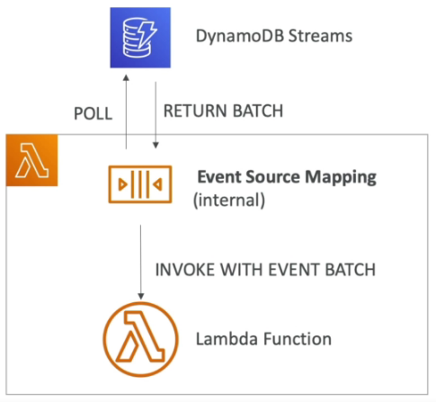

# DynamoDB

## Overview

- NoSQL, serverless database.
- Fully managed with auto-scaling.
- Doesn't support join.
- All data needed for a query should be in one row.
- Don't perform aggregations like "SUM".
- Multi-AZ replication.
- Very high capacity.
- Auto-scales, low cost.

## Tables

- Each table has a primary key.
- Supports an infinite number of items.
- Table attributes can be nested and added over time.
- Maximum size of an item is 400KB.
- Uses provisioned read/write capacity units.

## Data Types

- String, Number, Binary, Boolean, Null.
- List, Map, Set.

## Primary Keys

### Partition Key

- Unique for each item.
- Must be unique so that it can be distributed.

### Partition Key + Sort Key

- Combination must be unique.
- Data is grouped by partition key, then sorted by sort key.

## Throughput

- RCU/WCU can be auto-scaled.
- "Burst Credit" allows throughput to be temporarily exceeded.
- A ```ProvisionedThroughputException``` will be thrown if burst credit is exceeded. Fix via
  exponential back-off.
- A ```ProvisionedThroughputExceededException``` will be thrown if RCU/WCU is exceeded. Could be
  caused by hot keys, hot partitions of very large items. Fix via exponential back-off,
  distributing partition keys better, or use DynamoDB Accelerator.
  - RCU/WCU is spread evenly between partitions.
- Round up to nearest KB when calculating RCU/WCU.
- Eventually consistent reads may return old data due to replication delays. Can use
  ```ConsistentRead``` on ```GetItem```, ```Query``` and ```Scan```.
- Strongly consistent reads will return the latest data.
- Calculating RCU/WCU:

    | Operation                  | Reads/Second | Item Size |
    |----------------------------|--------------|-----------|
    | Eventually Consistent Read | 2            | 4KB       |
    | Strongly Consistent Read   | 1            | 4KB       |
    | Write                      | 1            | 1KB       |

## Partitions

- Data is divided into partitions.
- Partition keys are hashed to determine which partition they go to.
- Calculating the number of partions:

    | How         | Method                              |
    |-------------|-------------------------------------|
    | By Capacity | (total RCU/3000) + (total WCU/1000) |
    | By Size     | Total Size/10GB                     |

- Total number of partitions is the max of capacity and size.

## Reading Data

- ```GetItem``` to read based on a primary key (hash or hash range). ```ProjectionExpression```
  can be used to limit the item attributes that are returned.
- ```BatchGetItem``` to retrieve upto 100 items (16MB data).

## Writing Data

- ```PutItem``` to create or replace an item.
- ```UpdateItem``` to update an item. Can use an atomic counter to consistently
  increment/decrement a value.
- ```BatchWriteItem``` to write up to 25 ```PutItem``` or ```DeleteItem``` in one call. Reduces
  latency, and cost. Maximum batch size is 16MB. Part of the batch can fail, and the failed items
  would have to be retried.

### Conditional Writes

- Accept a write/update only if conditions are met. Good for concurrent acess.

## Deleting Data

- ```DeleteItem``` to delete a row. Can do conditional deletes.
- ```DeleteTable``` to delete an entire table.

## Querying Data

- ```Query``` returns items based on the partion key and (optional) sort key.
    - Use ```FilterExpression``` to perform client-side filtering.
    - Up to 1MB of data.
    - Supports limit/pagination.
    - Can query a table, local secondary index, or a global secondary index.
- ```Scan``` scans the whole table, then filters data.
    - Inefficient.
    - Max 1MB of data.
    - Supports limit/pagination.
    - Parallel scan will scan faster.
    - Supports ```ProjectionExpression``` and ```FilterExpression```.

## Indexes

### Local Secondary Index

- Range key for the table.
- Bound to the partition key.
- Must be defined when the table is created.
- Up to five LSI per table.
- Sort key must be string, number or binary attribute.

### Global Secondary Index (GSI)

- Can be added/modified on the fly.
- Speeds up queries on non-key attributes.
- Uses partition key + sort key.
- Generates a new table that item attributes are projected on to using the ```INCLUDE```, 
  ```ALL``` or ```KEYS_ONLY``` parameters.
- Have to define a WCU/RCU for the GSI.
- If GSI writes are throttled, it will throttle the main table.

## Concurrency

- DynamoDB uses optimistic locking. 
- The first concurrent request to modify an object "wins". The remaining concurrent requests will 
  fail.

## DynamoDB Accelerator (DAX)

- Caching techology. Effectively transparent to the client.
- Writes go through DAX, which allows for sub-millisecond latency for cached reads and queries.
- Solves the hot key problem to reducing the amount of times the key is read.
- Default TTL is 5mins.
- Up to 10 nodes in a cluster.
- Multi AZ.
- Supports encryption at rest.
- For aggregation results, use ElastiCache.

## DynamoDB Streams

- Changes to DynamoDB can be sent to a DynamoDB stream, to be read by Lambda, EC2 instances etc.
- Good for reacting to changes in realtime, analytics, creating derived tables/views, inserting
  into elasticsearch.
- Supports cross-region replication.
- 24hr data retention (can't be changed).
- Chose what data to send to the stream:
    - ```KEYS_ONLY``` to send just the primary key.
    - ```NEW_IMAGE``` to send the modified item.
    - ```OLD_IMAGE``` to send the unmodified item.
    - ```NEW_AND_OLD_IMAGES``` to send the modified, and unmodified items.
- Streams consist of shards, that are fully managed by AWS.
- Only new records will be added to a stream.

### DynamoDB Streams + Lambda

- Have to define an ```Event Source Mapping``` for Lambda to read from a stream.
- Create a trigger from DynamoDB Streams that executes a Lambda function.
- Lambda function is invoked asynchronously.



## Time to Live (TTL)

- Automatically delete an item after an expiry date/time.
- No cost, doesn't use WCU/RCU.
- Reduces storage capacity, helps adhere to regulatory requirements re data retention.
- Enabled per row (select which attribute represents the epoch timestamp).
- Expired items usually deleted within 48hrs, and are also delete from any indexes (GSI/LSI).
- Could use DynamoDB Streams to help recover expired items.

## DynamoDB CLI

- ```--project-expression``` to specify a list of attributes to retrieve from the table.
- ```--filter-expression``` to filter the results. The filter expression filter is defined using
  ```--expression-attribute-values```.
- ```--page-size``` to limit the number of items per page. Happens in the background, the full set
  of results are returned, it just consumes more RCU by running the query multiple times.
- ```--max-items``` to enable pagination and set the maximum number of results to be returned.
  Returns ```NextToken```.
- ```--starting-token``` to read the next page.

## Transactions

- Execute CRUD operations across multiple tables at the same time.
- All or nothing operation. If any operation fails, the entire transaction fails.
- Uses twice the RCU/WCU. eg: 3 writes/sec @ 5KB = (5KB/1KB) * 2 * 3 = 30WCU. 3 reads/sec @ 5KB = (5KB/4KB) * 2 * 3 = 12RCU.
- ```TransactWriteItems``` to write.
- ```TransactGetItems``` to read.

## DynamoDB as a Session State Cache

- Common use case.
- Use ElastiCache when it's ok to store the cache in memory. Use DynamoDB when serveless/auto
  scaling is needed.
- Use EFS to store session cache when session state needs to be shared across multiple EC2
  instances.
- Use EBS/Instance store for local caching (not shared).

### Write Sharding

- Add a random/calculated suffix to the partition keys to scale writes across multiple shards.

## Write Types

| Type        | Description                                                                                     |
|-------------|-------------------------------------------------------------------------------------------------|
| Concurrent  | The last concurrent write wins.                                                                 |
| Conditional | Only update the item based on a condition (eg: only update if the items value = \<some value>). |
| Atomic      | Uses an atomic counter to allow concurrent writes to increment/decrement an items attribute.    |
| Batch       | Update many items at the same time.                                                             |

## DynamoDB Patterns for S3

### Large Objects Pattern

- Send the large data to S3.
- Insert metadata into DynamoDB that points to the location of the S3 object.

### Indexing S3 Object Metadata

- Write to S3.
- Trigger a lambda function, and write metadata about the S3 object into DynamoDB.
- Now you can query DynamoDB for object metadata.

## Operations

- Fastest way to clean up a table is to use ```DeleteTable```, then re-create it.
- Copy a table using AWS DataPipeline (via EMR), which will export a table to S3, then load the S3
  object into a new DynamoDB table. Can also copy by running a backup, then restoring it into a
  new table, or scanning the entire table and writing the items into the new one.

## Security

- Use VPC endpoints to access DynamoDB without going over the internet.
- Use IAM for access control.
- Encryption at rest using KMS.
- Encryption in transit using SSL/TLS.
- There's a point-in-time Backup & Restore feature.
- Global tables are multi-region, high performance and fully replicated.
- use Amazon Database Migration Service (DMS) to migrate databases to DynamoDB.
- DynamoDB can be run locally.
- Use Web Identity Federation (WAF) to get temporary credentials that can be used by web/mobile 
  apps to directly talk to DynamoDB. Use a condition on the IAM policy to limit what tables the
  user can access.
    - ```LeadingKeys``` set row-level access limits.
    - ```Attributes``` to limit what attributes the user is allowed to see.
