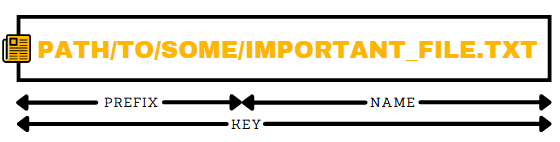
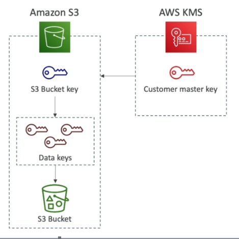

# Simple Storage Service (S3)

## Overview

- S3 buckets are bound to a region.
- Buckets must have a globally unique name.
- Public access is blocked by default.
- Bucket names must be DNS compliant -
    - No uppercase
    - No underscore
    - 3-63 chars
    - Not an IP
    - Must start with a lowercase letter or number

## S3 Objects



- Max object size is 5TB.
- Use multi-part upload for anything over 5GB.
- Add extra metadata using key/value pairs.
- Can be tagged.
- Have a version id if versioning is enabled.
- Objects within the bucket can have different ACLs, encryption methods, storage classes etc.
- Use Pre-signed URLs to access an object without using the public URL.

### Versioning

- Enabled at the bucket level.
- New version generated each time an object with the same key is over-written.
- Files not versioned prior to enabling versioning will have a```null``` version id.
- Suspending versioning doesn't delete the previous versions.
- Delete marker is created when a file is deleted. Old versions of the file will remain accessible.
- Restore a file by deleting the delete marker.

## Encryption

There's four ways to encrypt objects, and a bucket can have a default encryption method.

| Method                 | Description                                                            |
|------------------------|------------------------------------------------------------------------|
| SSE-S3                 | Use keys handled and managed by AWS.                                   |
| SSE-KMS                | Use AWS KMS to manage encryption keys.                                 |
| SSE-C                  | Manage your own encryption keys.                                       |
| Client Side Encryption | Customer fully manages the encryption/decryption process on the client side. |

### SSE-S3

- Encryption keys managed by AWS S3.
- Uses AES-256.
- Must add the header ```"x-amz-server-side-encryption": "AES256"```.

### SSE-KMS

- Encryption keys are managed in AWS KMS.
- Can control who has access to the encryption keys.
- Usage is logged in CloudTrail.
- Customer Master Key (CMK) is used to encrypt S3 objects.
- Requires the ```"x-amz-server-side-encryption": "aws:kms"``` header.
- Needs a KMS key policy that authorizes the user/role.

### SSE-C

- Uses a data key provided by the user.
- Key isn't stored by S3.
- Must use HTTPS.
- Encryption key needs to be in the HTTP header.

### Client Side Encryption

- Customer fully controls the encryption/decryption cycle.
- Clients must encrypt/decrypt the object themselves.
- S3 Encryption Client library can help do this.

### Encryption in Transit (TLS/SS)

- S3 endpoints can be utilized using HTTP, or HTTPS.
- Force SSL by creating a ```DENY``` rule on the condition ```"aws:SecureTransport": "false"```.
  Setting ```aws:SecureTransport``` to ```true``` would allow anonymous GetObject if using SSL.

      ```json
      {
        "Version": "2012-10-17",
        "Statement": [
          {
            "Sid": "AllowSSLRequestsOnly",
            "Action": "s3:*",
            "Effect": "Deny",
            "Resource": [
              "arn:aws:s3:::awsexamplebucket",
              "arn:aws:s3:::awsexamplebucket/*"
            ],
            "Condition": {
              "Bool": {
                "aws:SecureTransport": "false"
              }
            },
            "Principal": "*"
          }
        ]
      }
      ```
- On ```SSE-KMS```, need to limit the encryption headers to SSE-KMS only, and deny on no header.

      ```json
      {
        "Version": "2012-10-17",
        "Statement": [
          {
            "Sid": "DenyIncorrectEncryptionHeader",
            "Effect": "Deny",
            "Principal": "*",
            "Action": "s3:PutObject",
            "Resource": "arn:aws:s3:::bucket_name/*",
            "Condition": {
              "StringNotEquals": {
                "s3:x-amz-server-side-encryption": "aws:kms"
              }
            }
          },
          {
            "Sid": "DenyUnencryptedObjectUploads",
            "Effect": "Deny",
            "Action": "s3:PutObject",
            "Resource": "arn:aws:s3::bucket_name/*",
            "Condition": {
              "Null": {
                "s3:x-amz-server-side-encryption": true
              }
            }
          }
        ]
      }
      ```

### Default Encryption

- Bucket policies are evaluated before default encryption.
- Can use AES-256 via ```SSE-S3```, or ```SSE-KMS```.

### S3 Bucket Key

- Reduces API calls to KMS (reduces costs).
- Encryption Workflow -

      

      1. AWS KMS generates a S3 bucket key using the CMK.
      2. S3 generates a Data Encryption Key (DEK) using the S3 Bucket Key.
      2. S3 Objects are encrypted using the Data Encryption Keys (DEKs).

## S3 Security

### User Based Security

- Controlling the API calls that are allowed for a given user using IAM policies.
- The IAM Principal (user) can access an S3 Object if:
    - The users IAM permissions allow it, or the resource policy allows it.
    - There's no explicit DENY on the bucket policy.

### Resource Based Security

- Object ACL can apply ACLs at the object level.
- Bucket ACL applies to the whole bucket. Not commonly used.

#### Bucket Policy

- Applies to the whole bucket.
- Rules are defined in the S3 console, which allows cross-account access.
- Can be applied to bucket and objects.
- Blocking public access to buckets and objects can be done through:
    - Access Control Lists (ACLs).
    - A new public bucket, or access point policies.
- Blocking public and cross-account access to buckets and objects can be done through:
    - Any public bucket or access point policy.
- Blocking public access to buckets can be set at the account level.

???+ example "Example Bucket Policy"

    ```json
    {
      "Version": "2012-10-17",
      "Statement": [
        {
          "Sid": "PublicRead",
          "Effect": "Allow",
          "Principal": "*",
          "Action": [
            "s3:GetObject"
          ],
          "Resource": [
            "arn:aws:s3:::mybucket/*"
          ]
        }
      ]
    }
    ```

### Networking

- A VPC endpoint can be used to access a private bucket from other resources in the same VPC.

### Logging & Auditing

- S3 access logs can be stored in another S3 bucket.
- API usage is logged to CloudTrail.

#### S3 Access Logs

- Logs all S3 Bucket access to another bucket.
- Use data analysis tools/Athena to analyse the access logs.
- Don't send logs to the same bucket that's being monitored.
- Can define a prefix to use on all of the generated logfiles.

### User Security

#### MFA-Delete

- Requires MFA to delete an object version (adding a marker), or suspend versioning on the bucket.
- Versioning must be enabled on the bucket.
- Can only be enabled/disabled by the bucket owner.
- Can only be configured via the CLI.

#### Pre-signed URLs

- Can be created via CLI or the SDK.
- Default expiration is 3600secs. Change using the ```--expires-in``` argument.
- Users given the pre-signed URL inherit the permissions of the person that generated the URL.
- The S3 signature version needs to be s3v4.

##### Generating a Pre-signed URL

```shell
$ aws configure set default.s3.signature_version s3v4
$ aws s3 presign <S3Uri> --expires-in <seconds> --region <bucket region>
```

##### Use Cases

- Allow only logged in users to download a resource.
- Dynamically generating URLs due to high user churn.
- Temporarily allow a user to upload a file to a specific location in the bucket.

## S3 Static Websites

- Accessible via ```<bucket name>.s3-website-<region>.amazonaws.com```
- Bucket needs to be public, with a S3 policy that allows public reads, otherwise you'll get a 403
  error.
- Bucket objects need to be un-encrypted.
- Can set a custom index and error page.
- Can define redirection rules.

### CORS

- Allows the website to make requests to other origins than have been white-listed.
- Uses the ```Access-Control-Allow-Origin``` header to control permitted origins.

### S3 CORS

- Allow a specific origin via an explicit name, or use "*" to allow all origins.
- CORS headers must be enabled on cross-origin buckets, to allow a client to do a cross-origin
  request.

## Consistency Model

- ```PUT``` on new objects has Read after write consistency.
- ```PUT```/```DELETE``` on existing objects is eventually consistent.
- There's no way to request strong consistency.

## S3 Replication

- Asynchronous.
- Must enable versioning in the source and destination buckets.
- Requires an IAM role with permissions to copy between buckets.
- Only new objects created after replication is enabled will be copied across.
- Deletes are not replicated.
    - Deleting without a ```version id``` will create a delete marker.
    - Deleting with a version id will delete in the source only.
- No replication chaining.
    - Where ```bucket1``` is replicating into ```bucket2```, and ```bucket2``` is replicating into
      ```bucket3```, objects created in ```bucket1``` won't be replicated to ```bucket3```.
- Can replicate the whole bucket, or only specific prefixes/tags.
- Can replicate objects encrypted with AWS KMS.

### Cross-Region Replication (CRR)

- S3 replication between buckets in different regions.
- Used for compliance, low latency access, replication across accounts.

### Same Region Replication (SRR)

- S3 replication between buckets in the same region.
- Used for log aggregation, live replication between prod and test accounts.

## S3 Storage Classes

### S3 Standard - General Purpose

- 11 9's durability.
- 4 9's availability.
- Can handle upto 2 concurrent facility failures.
- General purpose.
- Minimum storage duration is 30 days.
- No retrieval fee.

#### Use Cases

- Big data analytics.
- Mobile & gaming applications.
- Content distribution.

### S3 Standard - Infrequent Access (IA)

- Data that isn't accessed very often, but needs to be retrieved quickly when needed.
- 11 9's durability.
- 3 9's availability.
- Cheaper than S3 Standard.
- Minimum storage duration is 30 days.
- Retrieval fee per GB retrieved.

#### Use Cases

- DR.
- Backups.

### S3  One Zone - Infrequent Access

- Same as IA, but data stored in a single AZ.
- 11 9's durability of objects in a single AZ.
- 99.5% availability.
- Low latency, high throughput.
- Supports SSL for encryption at in transit/at rest.
- 20% cheaper than IA.
- Minimum storage duration is 30 days.
- Retrieval fee per GB retrieved.

#### Use Cases

- Secondary backup copies of on-prem data.
- Storing data that could be re-created if needed.

### S3 Intelligent Tiering

- Low latency, high throughput.
- Additional cost to monitor objects and automatically move them between two different access tiers.
- 11 9's durability.
- 3 9's availability.
- Resilient to loss of entire AZ.
- Minimum storage duration is 30 days.
- No retrieval fee.

### Glacier

- Low cost.
- Intended for archiving/backups.
- Retaining data for a long time (multiple years).
- Alternative to magnetic tape storage.
- 11 9's durability.
- Each object is called an Archive and can be upto 40TB.
- Archives are stored in Vaults, not buckets.
- Minimum storage duration is 90 days.
- Retrieval fee per GB retrieved.

#### Retrieval Options

- Expidited (1-5mins).
- Standard (3-5hrs).
- Bulk (5-12hrs).

### Glacier Deep Archive

- Cheapest option.
- Minimum storage duration is 180 days.

#### Retrieval Options

- Standard (12hrs).
- Bulk (48hrs).

## Lifecycle Configuration (Policies)

- Lifecycle rules define when to move an object to another storage class.
- Expiration actions define when an object/previous versions will be deleted, or when to clean up incomplete multi-part uploads.
- Rules can be applied against a specific prefix, or object tags.

### Lifecycle Rule Actions

- Transition current versions between storage classes.
- Transition previous versions between storage classes.
- Expire current versions.
- Permanently delete previous versions.
- Delete expired delete markers or incomplete multi-part uploads.

## Performance

- Latency of 100-200ms.
- 3,500 PUT/COPY/POST/DELETE requests per second, per bucket prefix.
- 5,500 GET/HEAD requests per second, per bucket prefix.
- Using SSE-KMS will impose KMS limits (fixed number of API requests per second).

### Optimising

- Use multi-part uploads for files over 100MB. Mandatory for 5GB+.
- Use S3 Transfer Acceleration for uploads. Transfers the file to an edge location, and forwards it from there to the S3 bucket using the private AWS network.
- Use S3 Byte-Range fetches to download files (simlar to multi-part uploads).
- Only retrieve part of the object (ie: the head of a file).

## S3 Select/Glacier Select

- Retrieve less data using SQL via server side filtering.
- Filter by rows and columns.
- Reduces network transfer, client-side CPU usage.
- Useful for structured data (csv files etc).

## Event Notifications

- S3:ObjectCreated, S3:ObjectRemoved, S3:ObjectRestore, S3:Replication
- Can filter by object name.
- Good use case, is generating thumbnails when an image is uploaded to S3.
- Delivered within seconds.
- Bucket versioning is required to ensure an event is sent for every successful write.
- Can send the event to SQS, SNS or Lambda function.

## S3 Object Lock

- Write Once, Read Many.
- Block object version deletion for a specified amount of time.

## Glacier Vault Lock

- Write Once, Read Many.
- Lock the policy for future edits.
- Useful for compliance & data retention.
