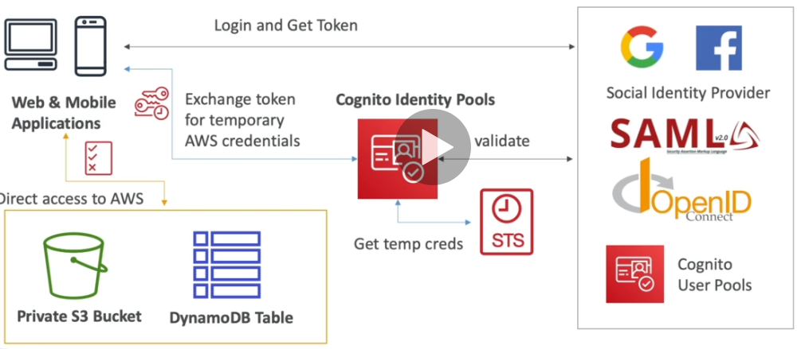

# Cognito

## Overview

Cognito gives users an identity so they can interact with an application.

## Cognito User Pools (CUP)

Cognito User Pools are a serverless database of users for web & mobile applications.

- Can integrate with API gateway & ALB (with listeners and rules).
- Uses a username (or email address)/password combination.
- Supports password reset, email/phone number verification, MFA.
- Support federated identities (Facebook, Google, Apple, Amazon, SAML, OpenID Connect).
- User accounts can be blocked if their credentials are comprised somewhere.
- Login returns a JWT token.
- Custom CSS and Logo can be added to the login UI.
- Has triggers for AWS Lambda during the authentication flow.

### Lambda Triggers

Lambda triggers allow Cognito User Pools to invoke a lambda function synchronously when certain
events occur.

| User  Pool Flow | Operation            | Description                                                     |
|-----------------|----------------------|-----------------------------------------------------------------|
| Authentication  | Pre Authentication   | Custom validation to accept/deny the sign-in request.           |
| Authentication  | Post Authentication  | Event logging for custom analytics.                             |
| Authentication  | Pre Token Generation | Augment or suppress token claims.                               |
| Sign-Up         | Pre Sign-up          | Customer validation to accept/deny sign-up requests.            |
| Sign-Up         | Post Confirmation    | Custom welcome messages, or event logging for custom analytics. |
| Sign-Up         | Migrate User         | Migrate a user from an existing user directory to user pools.   |
| Messages        | Custom Message       | Advanced customisation and localisation of messages.            |
| Token Creation  | Pre Token Generation | Add/remove attributes in Id tokens.                             |

## Cognito Identity Pools (Federated Identity)

Cognito Identity Pools obtain AWS credentials for application users so they can access AWS resources.

- Can allow unauthenticated (guest) access.
- Users can login via Facebook, Google, Apple, Amazon, OpenID, SAML, Cognito User Pools, Developer
  authenticated identities (custom login server).
- Can use Cognito User Pools as an identity provider.
- Users are mapped to IAM roles & policies.
- IAM policies can be customised based on the ```user_id``` variable for fine-grained control.
- Push synchronization pushwa changes made to user settings on one device, to all other devices.
- Cognito streams pushwa changes to a Kinesis steam for realtime event processing.
- Cognito events allows lambda functions to run in response to Cognito events.

### Authentication Process



### IAM Roles

- Default roles can be defined for authenticated and guest users.
- Rules can be used to determine which role is given to each user, based on their ```user_id```.
- Use poolicy variables to partition users.
- Cognito Identity Pools obtain IAM credentials via STS.
- Roles must have a trust policy of Cognito Identity Pools.

???+ example "Guest Policy"
    This policy allows unauthenticated access to ```my_picture.jpg```.

    ```json
    {
        "Version": "2012-10-17",
        "Statement": [
            {
                "Action": [
                    "s3:GetObject"
                ],
                "Effect": "Allow",
                "Resource": [
                    "arn:aws:s3::mybucket/assets/my_picture.jpg"
                ]
            }
        ]
    }
    ```

???+ example "Authenticated User Policy"
    This policy allows an authenticated user to list bucket contents that start with the users user
    id, and modify any objects that exist under a location that matches the users user id.

    ```json
    {
        "Version": "2012-10-17",
        "Statement": [
            {
                "Action": [
                    "s3:ListBucket"
                ],
                "Effect": "Allow",
                "Resource": ["arn:aws:s3::mybucket"],
                "Condition": {
                    "StringLike": {
                        "s3:prefix": [
                            "${cognito-identity.amazonaws.com:sub}/*"
                        ]
                    }
                }
            },
            {
                "Action": [
                    "s3:GetObject",
                    "s3:PutObject"
                ],
                "Effect": "Allow",
                "Resource": [
                    "arn:aws:s3::mybucket/${cognito-identity.amazonaws.com:sub}/*"
                ]
            }
        ]
    }
    ```

## Cognito Sync

Cognito Sync synchronises data from mobile devices to Cognito.

- Deprecated and replaced by AppSync.
- Store preferences, configuration, state of app.
- Has offline capability.
- Max size of each data set is 1MB.
- Up to 20 datasets can be stored.
- Push sync silently notifies all devices when identity data changes.
- Cognito stream sends data from Cognito to Kinesis.
- Cognito events execute lambda functions in response to events.

## Cognito vs IAM

Use Cognito when you need to support hundreds of users, mobile users, or need to authenticate with
SAML.
