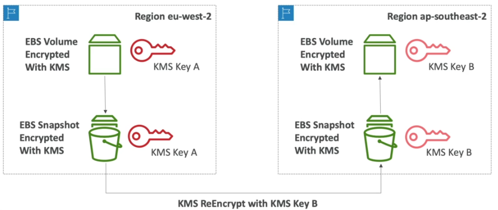

# AWS Key Management Service (KMS)

Managed key management service.

- Integrated with IAM for authorization.
- Integrated into most AWS services that need to use encryption.
- Can be used to create, enable/disable keys, or configure rotation policies.
- Audit key usage via Cloudtrail.
- Pay for each call to KMS.
- Can only encrypt upto 4KB of data per call. For more than 4KB use envelope encryption.
- To provide access, the Key Policy needs to allow the user, and the IAM policy needs to allow API calls.
- Keys are bound to a region.
- Enable encryption helpers in lambda function, and give it the KMS CMK to encrypt/decrypt variables.

## Use Cases

- Database passwords.
- Credentials to external services.
- SSL cert private keys.

## Customer Master Keys (CMK)

The CMK used to encrypt/decrypt data can't be retrieved by the user. There's 3 types of CMKs -

1) AWS Managed Service (free)
2) User created keys ($1/month)
3) Import keys ($1/month)

### Symmetric (AES265) Keys

- A single encryption key is used for encryption & decryption.
- Mandatory for envelope encryption.
- Access to the unencrypted key is not possible.
- Used by AWS services that integrate with KMS.

- ```Encrypt``` API will encrypt up to 4KB of data.
- ```Decrypt``` API will decrypt up to 4KB of data.
- ```GenerateDataKey``` API will generate a unique Data Encryption Key (DEK). It returns a plain-text copy, as well as an encrypted version stored under the CMK.
- ```GenerateDataKeyWithoutPlaintext``` API will generate a DEK and place it under the CMK. Doesn't return a plain-text copy. Use ```Decrypt``` later on to get the plain-text version.
- ```GenerateRandom``` API will create a random byte string.

### Assymetric Keys (RSA and ECC key pairs)

- Public key for decryption, and private key for encryption (eg: SSL).
- Used for encrypt/decrypt, or sign/verify operations.
- Public key is downloadable, private key isn't accessible in unencrypted form.
- Useful for encryption outside of AWS by users that can't call the KMS API.

## Copying Snapshots Between Regions

- Attach a KMS Key Policy that authorizes cross-account access.



## KMS Key Policies

- Control access to KMS keys, similar to S3 policies.
- Can't control access without them.

### Default KMS Key Policy

- Root user has complete access to the key.
- Give users access by attaching an appropriate IAM policy.

### Custom  KMS Key Policy

- Define users & roles that can access the key.
- Define who can administer the key.
- Useful for cross-account access of the key.

## Encryption Patterns

## Envelope Encryption

- Use the ```GenerateDataKey``` API to obtain a data encryption key.
- Use client-side encryption to encrypt the large file using the data encryption key.
- Place the encrypted DEK provided by AWS, and the encrypted file into a new file (the envelope).
- To decrypt, send the encrypted DEK to the ```Decrypt``` API, then use the decrypted DEK to
  decrypt the file.

## Encryption SDK

- Has a Data Key Caching feature to allow a data key to be re-used, instead of using a new key for
  every encryption.
- Reduces the number of calls to KMS, but reduces security.
- Use LocalCryptoMaterialsCache (max age, max bytes, max number of messages) to define how big the
  data cache should be.

## Request Quotas

All crypto operations for an account in a particular region are subject to a request/sec quota - 

* Decrypt
* Encrypt
* GenerateDataKey
* GenerateDataKeyWithoutPlaintext
* GenerateRandom
* ReEncrypt
* Sign (asymmetric)
* Verify (asymmetric)

A ```ThrottlingException``` will be raised if the request quota is exceeded. There's three ways to
deal with the problem:

1. Use an exponential backoff.
2. Use envelope encryption + DEK caching to reduce the number of GenerateDataKey requests.
3.  Request a quota increase through the API, or an AWS support ticket.

### Symmetric Keys

- 5,500 requests/sec.
- 10,000 in us-east-2, ap-southeast-1, ap-southeast-2, ap-northeast-1, eu-central-1, eu-west-2.
- 30,000 in us-east-1, us-west-1, eu-west-1.

### Asymmetric Keys

- 500 for RSA CMKs.
- 300 for ECC CMKs.

