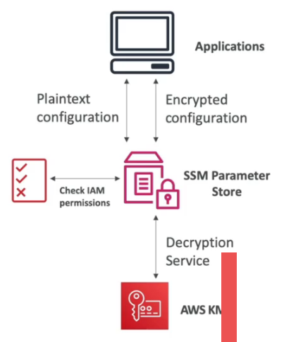

# SSM Parameter Store

## Overview

- Securely store configuration/secrets.
- Encrypt using KMS.
- Supports versioning.
- Supports configuration management via path (pull all secrets within that path) & IAM.
- Integrates with CloudWatch & CloudFormation.
- Supported parameter values are ```String```, ```StringList``` or ```SecureString```.
- To get specific parameter(s) - ```aws ssm get-parameters --names <name 1>, <name 2>```.
- To get parameters via path - ```aws ssm get-parameters-by-path --path /some/path```.




## Tiering

| Tier     | Max Parameters (per account, per region) | Max Param Size | Suppports Parameter Policies? | Cost       | Storage Cost | API price |
|----------|------------------------------------------|----------------|-------------------------------|------------|--------------|-----------|
| Standard | 10,000                                   | 4KB            | No                            | None       | Free         | Standard Throughput: Free, Higher throughput: $0.05/10,000 calls. |
| Advanced | 100,000                                  | 8KB            | Yes                           | Additional | $0.05/param  | $0.05/10,000 calls. |

## Parameter Policies

- Assign a TTL to parameter to force a delete/update.
- Supports multiple policies.
- Use ```Expiration```, ```ExpiresNotification``` or ```NoChangeNotification``` to define expiration policies, and when to be notified of lifecycle events.

## Secure Strings

- Use the ```SecureString``` parameter type, to encrypt using KMS.
- You can use the current account, or another AWS Account as the KMS key source.
- Add the ```--with-decryption``` to the CLI arg to decrypt the string value using KMS.
